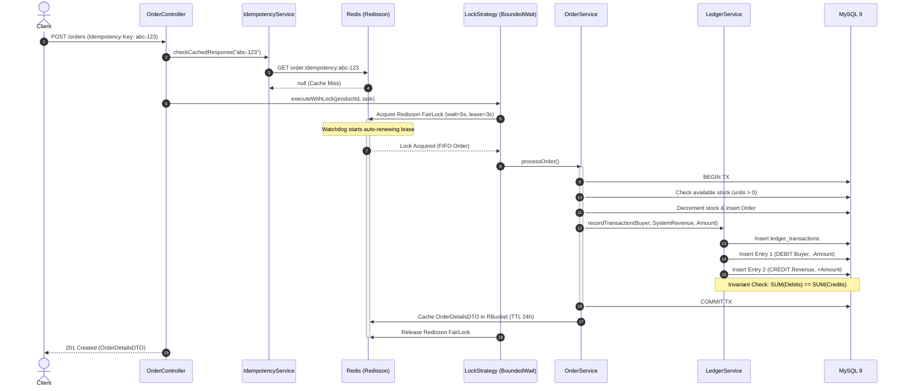
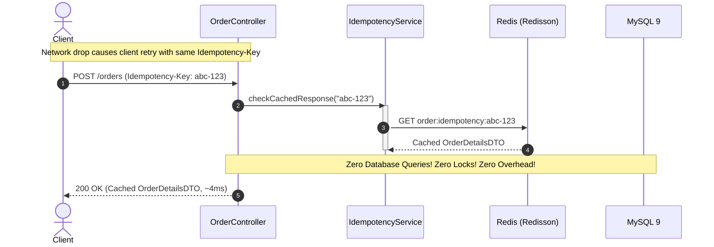
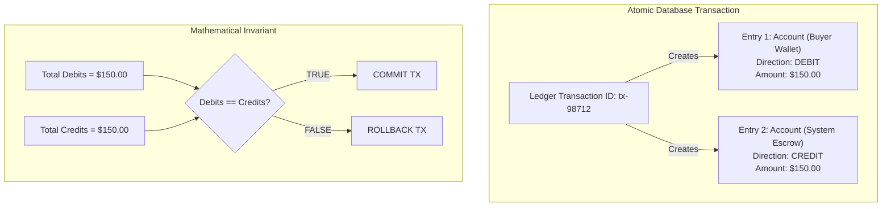

# FlashLedger: Distributed High-Throughput Booking & Double-Entry Ledger Engine

[](https://openjdk.org/)
[](https://spring.io/projects/spring-boot)
[](https://redis.io/)
[](https://redisson.org/)
[](https://www.mysql.com/)
[](https://flywaydb.org/)
[]()

> **FlashLedger** is a production-grade, distributed booking and double-entry financial ledger engine engineered in **Java 21**, **Spring Boot 3.4.5**, **Redis (Redisson 4.7.0)**, and **MySQL 9**. It solves the core concurrency and data integrity challenges of high-traffic flash sales and payment gateways: **zero inventory overselling under high contention**, **strict mathematical balance invariants ($\sum \text{Debits} == \sum \text{Credits}$)** with zero balance drift, and a **distributed idempotency key engine** delivering $\sim$4ms repeat response times.

---

## 1. Architectural Highlights & Core Pillars

| Distributed Pattern | Problem Solved | FlashLedger Implementation |
| :--- | :--- | :--- |
| **Distributed Fair Locking (Redisson)** | Concurrent threads reading inventory simultaneously read stale quantities, causing overselling and database connection pool starvation. | Uses Redisson Fair Locks (`RReadWriteLock` / `RLock`) with FIFO queueing. Implements the **Lock Acquisition Strategy Pattern** (`FailFastLockStrategy` vs. `BoundedWaitLockStrategy`) backed by Redisson's watchdog auto-renewal. |
| **Double-Entry Financial Ledger** | Direct `UPDATE accounts SET balance = balance - amount` leaves no audit trail, is non-auditable, lossy, and causes ledger drift. | Maintains immutable transactional journals (`accounts`, `ledger_transactions`, `ledger_entries`). Enforces strict mathematical equality ($\sum \text{DEBIT} == \sum \text{CREDIT}$) inside atomic `@Transactional` boundaries. Balances are derived dynamically (`SUM(CREDIT) - SUM(DEBIT)`). |
| **Distributed Idempotency Engine** | Network timeouts cause clients or frontends to resend requests, triggering duplicate orders or double deductions. | Intercepts HTTP `Idempotency-Key` headers. Caches serialized `OrderDetailsDTO` in Redis `RBucket` with a 24-hour TTL, returning repeat responses in $\sim$4ms while serializing concurrent double-clicks. |
| **Fail-Fast Database Shielding** | Surge traffic exhausts HikariCP database connections, causing cascading latency spikes and thread exhaustion. | Under heavy contention, `FailFastLockStrategy` immediately rejects excess requests before database transactions begin, shielding MySQL from thread pileups. |
| **Zero Balance Drift & Reconciliation** | Rounding errors, race conditions, or unhandled exceptions corrupt account balances over time. | Account balances are never stored as single mutable scalar columns. Every balance query calculates the delta of immutable ledger entries, guaranteeing zero drift by mathematical definition. |

---

## 2. System Architecture & Component Layout

```text
                                [ HTTP Client ]
                                       |
                                       v (POST /orders with Idempotency-Key)
                        +------------------------------+
                        |    OrderController (8080)    |
                        +--------------+---------------+
                                       |
            +--------------------------+--------------------------+
            |                                                     |
            v                                                     v
+------------------------------+                       +------------------------------+
|  Distributed Idempotency     |                       | Distributed Lock Strategy    |
|  - Check Redis RBucket cache |                       | - FailFast: immediate reject |
|  - If hit: return in ~4ms    |                       | - BoundedWait: FIFO queue    |
+------------------------------+                       +--------------+---------------+
                                                                      | (Lock Acquired)
                                                                      v
                                                       +------------------------------+
                                                       |      Order & Stock Service   |
                                                       |  - Validate stock & price    |
                                                       |  - Deduct inventory reserve  |
                                                       +--------------+---------------+
                                                                      | (Atomic Transaction)
                                                                      v
                                                       +------------------------------+
                                                       |  Double-Entry Ledger Engine  |
                                                       |  - DEBIT: Buyer account      |
                                                       |  - CREDIT: Revenue/Escrow    |
                                                       |  - Assert: SUM(D) == SUM(C)  |
                                                       +--------------+---------------+
                                                                      |
                                  +-----------------------------------+-----------------------------------+
                                  |                                                                       |
                                  v                                                                       v
                   +------------------------------+                                        +------------------------------+
                   |           MySQL 9            |                                        |           Redis 8            |
                   |  - orders & order_items      |                                        |  - Redisson Fair Locks       |
                   |  - inventory & products      |                                        |  - Idempotency Cache (24h)   |
                   |  - ledger_transactions       |                                        |  - Redisson Watchdog Lease   |
                   |  - ledger_entries & accounts |                                        +------------------------------+
                   +------------------------------+
```

---

## 3. Core Architectural Lifecycles & Sequence Flows

### 3.1 Flash-Sale Booking with Distributed Fair Locking



---

### 3.2 Distributed Idempotency: Sub-5ms Repeat Response



---

### 3.3 Double-Entry Accounting Ledger Mechanics



---

## 4. Multi-Module & Directory Topography

```text
flashledger/
├── docker-compose.yml              # MySQL 9.0 (Port 3306) & Redis 8.8 (Port 6379)
├── pom.xml                         # Java 21, Spring Boot 3.4.5, Redisson 4.7.0, Flyway 10
└── src/
    ├── main/
    │   ├── java/com/flashledger/flashledgerengine/
    │   │   ├── bootstrap/          # SystemAccountSeeder (Idempotent revenue account initialization)
    │   │   ├── config/             # RedissonConfig, JacksonConfig
    │   │   ├── controller/         # OrderController (Idempotency-Key handling & REST API)
    │   │   ├── dto/                # CreateOrderRequest, OrderDetailsDTO, ApiResponse
    │   │   ├── entity/             # Account, LedgerTransaction, LedgerEntry, Order, Product, Inventory
    │   │   ├── repository/         # AccountRepository, LedgerEntryRepository, OrderRepository...
    │   │   ├── service/            # OrderService, LedgerService, IdempotencyService
    │   │   └── strategy/           # LockStrategy, FailFastLockStrategy, BoundedWaitLockStrategy
    │   └── resources/
    │       ├── application.yml     # Database, Redis & Redisson properties
    │       └── db/migration/       # Flyway V1-V8 migration scripts
    └── test/                       # 11/11 automated integration tests
```

---

## 5. Technology Stack

- **Runtime & Language**: Java 21 LTS
- **Framework**: Spring Boot 3.4.5, Spring Data JPA, Spring Validation
- **Distributed Locking & Caching**: Redisson 4.7.0, Redis 8.8 Alpine
- **Database**: MySQL 9.0
- **Database Migrations**: Flyway 10 (V1 through V8 scripts)
- **Connection Pool**: HikariCP (leak detection and connection timeouts)
- **Testing**: JUnit 5, MockMvc, Spring Boot Test (`@SpringBootTest`)
- **Containers**: Docker Compose (MySQL 9 on 3306, Redis on 6379)

---

## 6. Automated Test Suite Matrix

FlashLedger is verified by an automated integration test suite running against real Redis and MySQL infrastructure:

| Test Class | Focus & Guarantee Tested | Result |
| :--- | :--- | :--- |
| `OrderServiceOverSellingTest` | **Zero Overselling**: 10 concurrent threads compete for scarce inventory; verifies exact stock count and zero oversold units. | Passed |
| `OrderServiceBoundedWaitTest` | **FIFO Fair Queueing**: Bounded wait strategy queues contending threads in fair order under watchdog renewal. | Passed |
| `OrderServiceFailFastTest` | **Database Protection**: Immediate rejection of excess requests under contention before hitting database transactions. | Passed |
| `LedgerServiceTest` | **Mathematical Invariant**: Verifies $\sum \text{Debits} == \sum \text{Credits}$ and rollback on unbalanced transactions. | Passed |
| `ServiceOrderIdempotencyTest` (Sequential) | **Sub-5ms Cache Replay**: Repeat request with identical `Idempotency-Key` returns cached order details in $\sim$4ms. | Passed |
| `ServiceOrderIdempotencyTest` (Concurrent) | **Double-Click Serialization**: Concurrent identical requests result in exactly 1 database write and 1 cached response. | Passed |
| `OrderServiceWithLedgerTest` | **Atomic Cross-Domain Coupling**: Verifies order placement and double-entry ledger entries commit atomically. | Passed |
| `OrderControllerIntegrationTest` | **Full HTTP Lifecycle**: MockMvc verification of `POST /orders`, HTTP status 201, and header extraction. | Passed |
| `SystemAccountSeederTest` | **Startup Idempotency**: Verified system revenue and escrow accounts initialize idempotently without duplicates. | Passed |

To run the complete test suite:
```bash
./mvnw clean test
```

---

## 7. Local Infrastructure Setup

### Prerequisites
- Java 21 LTS installed
- Docker and Docker Compose running

### Step 1: Start Infrastructure Containers
```bash
# Start MySQL 9 and Redis 8
docker compose up -d
```

### Step 2: Run Database Migrations & Start Engine
```bash
./mvnw spring-boot:run
```
Flyway will automatically execute migrations `V1__create_users_table.sql` through `V8__create_ledger_entries_table.sql`.

### Step 3: Place a High-Concurrency Order (with Idempotency Key)
```bash
curl -X POST http://localhost:8080/api/v1/orders \
  -H "Content-Type: application/json" \
  -H "Idempotency-Key: 9b1deb4d-3b7d-4bad-9bdd-2b0d7b3dcb6d" \
  -d '{
    "userId": 1,
    "productId": 101,
    "quantity": 1
  }'
```

Replaying the exact same `curl` command with the same `Idempotency-Key` will immediately return the cached order response in $\sim$4ms without touching MySQL.